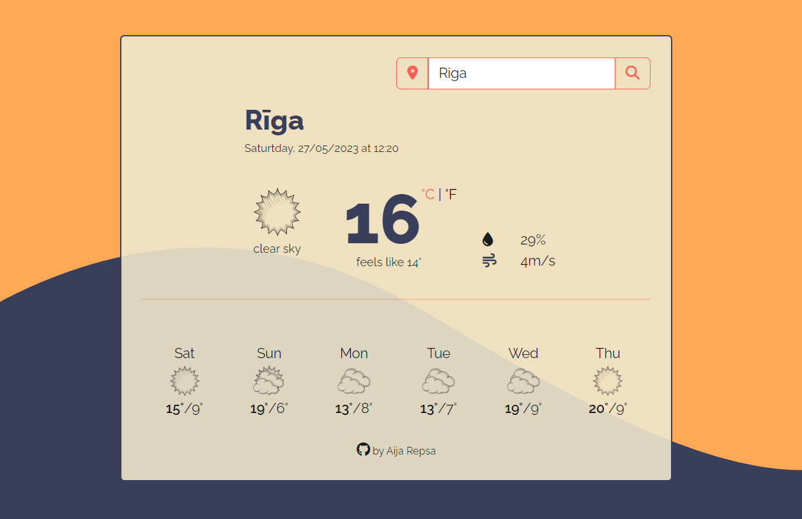

# Weather App
SheCodes Plus final project.  
Real-time weather app, using OpenWeather API. 
HTML (minimal Bootstrap), CSS and JavasScript.
You can change the location, by typing in a city or clicking current location button.
(F conversion not complete, only works for the current temp)

## Check the Weather App on Netlify

--> [Weather App](https://timely-syrniki-4ea92f.netlify.app/)

## Screenshot

